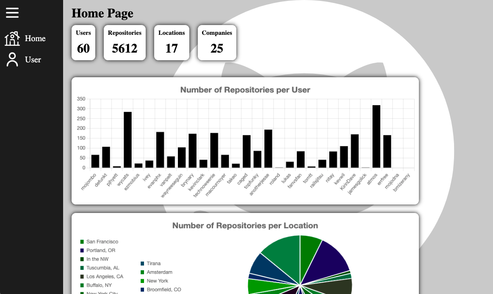
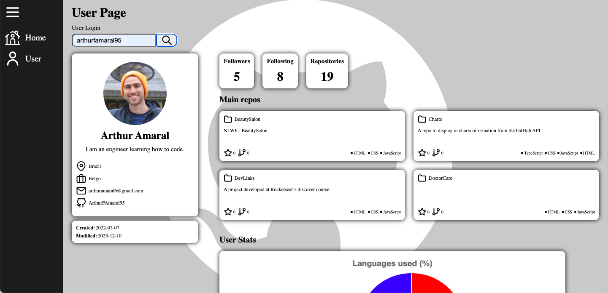

<h1 align="center">🐈‍⬛ GitHub Charts 📊</h1>

  

  

<h2>
This project is a two page app where you can see in the form of charts data retrieved from the GitHub API.
</h2>

## 💻 Project

This project has two pages where you can see different information in each one of them:

<h3>Home Page</h3>

In this page you can see an overall information based on the 30 first users of GitHUb like number of public repositories of each user or their location.

<h3>User Page</h3>

In this page you can see information of a specific user.
After searching the login, it is possible to see the user picture, name, location, main repositories and a few charts with the user data.

## 🚀 Technologies

This project was developed using the following technologies:

- HTML e CSS
- JavaScript
- React
- TypeScript
- Git e Github

## 🔖 How to access it

- Download the zip file, download the modules needed with <code>npm install</code>, run <code>npm run dev</code> on the terminal and access localhost on a browser.

- [Access the final project online](https://charts-olive.vercel.app/)

